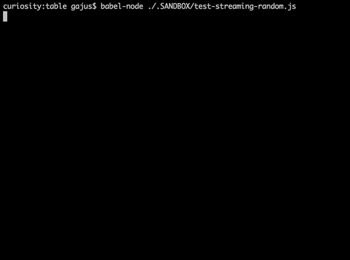

<a name="table"></a>
# Table

[](https://travis-ci.org/gajus/table)
[](https://coveralls.io/github/gajus/table)
[](https://www.npmjs.org/package/table)
[](https://github.com/gajus/canonical)
[](https://twitter.com/kuizinas)

* [Table](#table)
    * [Features](#table-features)
    * [Install](#table-install)
    * [Install](#table-install-1)
    * [Usage](#table-usage)
    * [APIs](#table-apis)
        * [table(data, config = {})](#table-apis-table-data-config)
        * [createStream(config)](#table-apis-createstream-config)
        * [getBorderCharacters(template)](#table-apis-getbordercharacters-template)


Produces a string that represents array data in a text table.


<a name="table-features"></a>
## Features

* Works with strings containing [fullwidth](https://en.wikipedia.org/wiki/Halfwidth_and_fullwidth_forms) characters.
* Works with strings containing [ANSI escape codes](https://en.wikipedia.org/wiki/ANSI_escape_code).
* Configurable border characters.
* Configurable content alignment per column.
* Configurable content padding per column.
* Configurable column width.
* Text wrapping.


<a name="table-install"></a>
## Install

```bash
npm install table

```

[](https://www.buymeacoffee.com/gajus)
[](https://www.patreon.com/gajus)

<a name="table-install-1"></a>
## Install

```bash
npm install table

```

[](https://www.buymeacoffee.com/gajus)
[](https://www.patreon.com/gajus)

<a name="table-usage"></a>
## Usage

```js
import {
  table
} from 'table';

// Using commonjs?
// const {table} = require('table');

const data = [
    ['0A', '0B', '0C'],
    ['1A', '1B', '1C'],
    ['2A', '2B', '2C']
];

output = table(data);

console.log(output);
```

```
╔════╤════╤════╗
║ 0A │ 0B │ 0C ║
╟────┼────┼────╢
║ 1A │ 1B │ 1C ║
╟────┼────┼────╢
║ 2A │ 2B │ 2C ║
╚════╧════╧════╝

```


<a name="table-apis"></a>
## APIs

<a name="table-apis-table-data-config"></a>
### table(data, config = {})

Returns the string in the table format

<a name="table-apis-table-data-config-data"></a>
#### data
Type: `any[][]`

<a name="table-apis-table-data-config-config"></a>
#### config
Type: `object`
Required: `false`

<a name="table-apis-table-data-config-config-config-border"></a>
##### config.border
Type: `{ [type: string]: string }`
Required: `false`
Default: see #predefined_border_templates

To custom border. The object with keys are any of:
- topLeft
- topRight
- topBody
- topJoin

- bottomLeft
- bottomRight
- bottomBody
- bottomJoin

- joinLeft
- joinRight
- joinBody
- joinRight

- bodyLeft
- bodyRight
- bodyJoin

```js
const data = [
  ['0A', '0B', '0C'],
  ['1A', '1B', '1C'],
  ['2A', '2B', '2C']
];

const config = {
  border: {
    topBody: `─`,
    topJoin: `┬`,
    topLeft: `┌`,
    topRight: `┐`,

    bottomBody: `─`,
    bottomJoin: `┴`,
    bottomLeft: `└`,
    bottomRight: `┘`,

    bodyLeft: `│`,
    bodyRight: `│`,
    bodyJoin: `│`,

    joinBody: `─`,
    joinLeft: `├`,
    joinRight: `┤`,
    joinJoin: `┼`
  }
};

console.log(table(data, config));
```

```
┌────┬────┬────┐
│ 0A │ 0B │ 0C │
├────┼────┼────┤
│ 1A │ 1B │ 1C │
├────┼────┼────┤
│ 2A │ 2B │ 2C │
└────┴────┴────┘
```

<a name="table-apis-table-data-config-config-config-drawverticalline"></a>
##### config.drawVerticalLine
Type: `(index: number, columnCount: number) => boolean`
Required: `false`
Default: `() => true`

Used to tell whether to draw a vertical line. This callback is called for each vertical border of the table.
If the table has `n` columns then the `index` parameter is alternatively received all numbers in range `0..n` inclusively.

```js
const data = [
  ['0A', '0B', '0C'],
  ['1A', '1B', '1C'],
  ['2A', '2B', '2C'],
  ['3A', '3B', '3C'],
  ['4A', '4B', '4C']
];

const config = {
  drawVerticalLine: (index, columnCount) => {
    return index === 0 || index === columnCount;
  }
};

console.log(table(data, options));

```

```
╔════════════╗
║ 0A  0B  0C ║
╟────────────╢
║ 1A  1B  1C ║
╟────────────╢
║ 2A  2B  2C ║
╟────────────╢
║ 3A  3B  3C ║
╟────────────╢
║ 4A  4B  4C ║
╚════════════╝

```

<a name="table-apis-table-data-config-config-config-drawhorizontalline"></a>
##### config.drawHorizontalLine
Type: `(index: number, rowCount: number) => boolean`
Required: `false`
Default: `() => true`

Used to tell whether to draw a horizontal line. This callback is called for each horizontal border of the table.
If the table has `n` rows then the `index` parameter is alternatively received all numbers in range `0..n` inclusively.

```js
const data = [
  ['0A', '0B', '0C'],
  ['1A', '1B', '1C'],
  ['2A', '2B', '2C'],
  ['3A', '3B', '3C'],
  ['4A', '4B', '4C']
];

const config = {
  drawHorizontalLine: (index, rowCount) => {
    return index === 0 || index === 1 || index === rowCount - 1 || index === rowCount;
  }
};

console.log(table(data, options));

```

```
╔════╤════╤════╗
║ 0A │ 0B │ 0C ║
╟────┼────┼────╢
║ 1A │ 1B │ 1C ║
║ 2A │ 2B │ 2C ║
║ 3A │ 3B │ 3C ║
╟────┼────┼────╢
║ 4A │ 4B │ 4C ║
╚════╧════╧════╝

```

<a name="table-apis-table-data-config-config-config-singleline"></a>
##### config.singleLine
Type: `boolean`
Required: `false`
Default: `false`

If true, horizontal lines inside the table are not drawn.

```js
const data = [
  ['-rw-r--r--', '1', 'pandorym', 'staff', '1529', 'May 23 11:25', 'LICENSE'],
  ['-rw-r--r--', '1', 'pandorym', 'staff', '16327', 'May 23 11:58', 'README.md'],
  ['drwxr-xr-x', '76', 'pandorym', 'staff', '2432', 'May 23 12:02', 'dist'],
  ['drwxr-xr-x', '634', 'pandorym', 'staff', '20288', 'May 23 11:54', 'node_modules'],
  ['-rw-r--r--', '1,', 'pandorym', 'staff', '525688', 'May 23 11:52', 'package-lock.json'],
  ['-rw-r--r--@', '1', 'pandorym', 'staff', '2440', 'May 23 11:25', 'package.json'],
  ['drwxr-xr-x', '27', 'pandorym', 'staff', '864', 'May 23 11:25', 'src'],
  ['drwxr-xr-x', '20', 'pandorym', 'staff', '640', 'May 23 11:25', 'test'],
];

const config = {
  singleLine: true
};

console.log(table(data, config));
```

```
╔═════════════╤═════╤══════════╤═══════╤════════╤══════════════╤═══════════════════╗
║ -rw-r--r--  │ 1   │ pandorym │ staff │ 1529   │ May 23 11:25 │ LICENSE           ║
║ -rw-r--r--  │ 1   │ pandorym │ staff │ 16327  │ May 23 11:58 │ README.md         ║
║ drwxr-xr-x  │ 76  │ pandorym │ staff │ 2432   │ May 23 12:02 │ dist              ║
║ drwxr-xr-x  │ 634 │ pandorym │ staff │ 20288  │ May 23 11:54 │ node_modules      ║
║ -rw-r--r--  │ 1,  │ pandorym │ staff │ 525688 │ May 23 11:52 │ package-lock.json ║
║ -rw-r--r--@ │ 1   │ pandorym │ staff │ 2440   │ May 23 11:25 │ package.json      ║
║ drwxr-xr-x  │ 27  │ pandorym │ staff │ 864    │ May 23 11:25 │ src               ║
║ drwxr-xr-x  │ 20  │ pandorym │ staff │ 640    │ May 23 11:25 │ test              ║
╚═════════════╧═════╧══════════╧═══════╧════════╧══════════════╧═══════════════════╝
```

<a name="table-apis-table-data-config-config-config-columns"></a>
##### config.columns
Type: `Column[] | { [index: number]: Column }`

Column specific configuration.

<a name="table-apis-table-data-config-config-config-columns-config-columns-width"></a>
###### config.columns[*].width
Type: `number`
Default: the maximum width of cells in the column

Column width

```js

const data = [
  ['0A', '0B', '0C'],
  ['1A', '1B', '1C'],
  ['2A', '2B', '2C']
];

const options = {
  columns: {
    1: {
      width: 10
    }
  }
};

console.log(table(data, options));
```

```
╔════╤════════════╤════╗
║ 0A │ 0B         │ 0C ║
╟────┼────────────┼────╢
║ 1A │ 1B         │ 1C ║
╟────┼────────────┼────╢
║ 2A │ 2B         │ 2C ║
╚════╧════════════╧════╝
```

<a name="table-apis-table-data-config-config-config-columns-config-columns-alignment"></a>
###### config.columns[*].alignment
Type: `'center' | 'justify' | 'left' | 'right'`
Default: `'left'`

Cell content horizontal alignment

```js
const data = [
  ['0A', '0B', '0C', '0D 0E 0F'],
  ['1A', '1B', '1C', '1D 1E 1F'],
  ['2A', '2B', '2C', '2D 2E 2F'],
];

const config = {
  columnDefault: {
    width: 10,
  },
  columns: [
    {alignment: 'left'},
    {alignment: 'center'},
    {alignment: 'right'},
    {alignment: 'justify'},
  ],
};

console.log(table(data, config));
```

```
╔════════════╤════════════╤════════════╤════════════╗
║ 0A         │     0B     │         0C │ 0D  0E  0F ║
╟────────────┼────────────┼────────────┼────────────╢
║ 1A         │     1B     │         1C │ 1D  1E  1F ║
╟────────────┼────────────┼────────────┼────────────╢
║ 2A         │     2B     │         2C │ 2D  2E  2F ║
╚════════════╧════════════╧════════════╧════════════╝
```

<a name="table-apis-table-data-config-config-config-columns-config-columns-paddingleft"></a>
###### config.columns[*].paddingLeft
Type: `number`
Default: `1`

The number of whitespaces used to pad the content on the left.

<a name="table-apis-table-data-config-config-config-columns-config-columns-paddingright"></a>
###### config.columns[*].paddingRight
Type: `number`
Default: `1`

The number of whitespaces used to pad the content on the right.

```js
const data = [
  ['0A', 'AABBCC', '0C'],
  ['1A', '1B', '1C'],
  ['2A', '2B', '2C']
];

const config = {
  columns: [
    {
      paddingLeft: 3
    },
    {
      width: 2,
      paddingRight: 3
    }
  ]
};

console.log(table(data, config));
```

```
╔══════╤══════╤════╗
║   0A │ AA   │ 0C ║
║      │ BB   │    ║
║      │ CC   │    ║
╟──────┼──────┼────╢
║   1A │ 1B   │ 1C ║
╟──────┼──────┼────╢
║   2A │ 2B   │ 2C ║
╚══════╧══════╧════╝
```

<a name="table-apis-table-data-config-config-config-columns-config-columns-truncate"></a>
###### config.columns[*].truncate
Type: `number`
Default: `Infinity`

Number of characters are which the content will be truncated.
To handle a content that overflows the container width, `table` package implements [text wrapping](#table-usage-text-wrapping). However, sometimes you may want to truncate content that is too long to be displayed in the table.

```js
const data = [
  ['Lorem ipsum dolor sit amet, consectetur adipiscing elit. Phasellus pulvinar nibh sed mauris convallis dapibus. Nunc venenatis tempus nulla sit amet viverra.']
];

const config = {
  columns: {
    0: {
      width: 20,
      truncate: 100
    }
  }
};

console.log(table(data, config));
```

```
╔══════════════════════╗
║ Lorem ipsum dolor si ║
║ t amet, consectetur  ║
║ adipiscing elit. Pha ║
║ sellus pulvinar nibh ║
║ sed mauris convall…  ║
╚══════════════════════╝
```

<a name="table-apis-table-data-config-config-config-columns-config-columns-wrapword"></a>
###### config.columns[*].wrapWord
Type: `boolean`
Default: `false`

`table` package implements auto text wrapping, i.e. text that has width greater than the container width will be separated into multiple lines at the nearest space or one of the special characters: `\|/_.,;-`.

When `wrapWord` is `false`:
```js
const data = [
    ['Lorem ipsum dolor sit amet, consectetur adipiscing elit. Phasellus pulvinar nibh sed mauris convallis dapibus. Nunc venenatis tempus nulla sit amet viverra.']
];

const config = {
  columns: [
    {
      width: 20
    }
  ]
};

console.log(table(data, config));
```

```
╔══════════════════════╗
║ Lorem ipsum dolor si ║
║ t amet, consectetur  ║
║ adipiscing elit. Pha ║
║ sellus pulvinar nibh ║
║ sed mauris convallis ║
║ dapibus. Nunc venena ║
║ tis tempus nulla sit ║
║ amet viverra.        ║
╚══════════════════════╝
```

When `wrapWord` is `true`:

```js
const data = [
  ['Lorem ipsum dolor sit amet, consectetur adipiscing elit. Phasellus pulvinar nibh sed mauris convallis dapibus. Nunc venenatis tempus nulla sit amet viverra.']
];

const config = {
  columns: [
    {
      width: 20,
      wrapWord: true
    }
  ]
};

console.log(table(data, config));
```

```
╔══════════════════════╗
║ Lorem ipsum dolor    ║
║ sit amet,            ║
║ consectetur          ║
║ adipiscing elit.     ║
║ Phasellus pulvinar   ║
║ nibh sed mauris      ║
║ convallis dapibus.   ║
║ Nunc venenatis       ║
║ tempus nulla sit     ║
║ amet viverra.        ║
╚══════════════════════╝

```

<a name="table-apis-table-data-config-config-config-columndefault"></a>
##### config.columnDefault
Type: `Column`

Default configuration for all columns. Column specific settings will overwrite the default values.


<a name="table-apis-createstream-config"></a>
### createStream(config)

`table` package exports `createStream` function used to draw a table and append rows.

`createStream` requires `columnDefault.width` and `columnCount` configuration properties.

```js
import {
  createStream
} from 'table';

const config = {
  columnDefault: {
    width: 50
  },
  columnCount: 1
};

const stream = createStream(config);

setInterval(() => {
  stream.write([new Date()]);
}, 500);
```


`table` package uses ANSI escape codes to overwrite the output of the last line when a new row is printed.

The underlying implementation is explained in this [Stack Overflow answer](http://stackoverflow.com/a/32938658/368691).

Streaming supports all of the configuration properties and functionality of a static table (such as auto text wrapping, alignment and padding), e.g.

```js
import {
  createStream
} from 'table';

import _ from 'lodash';

const config = {
  columnDefault: {
    width: 50
  },
  columnCount: 3,
  columns: [
    {
      width: 10,
      alignment: 'right'
    },
    { alignment: 'center' },
    { width: 10 }

  ]
};

const stream = createStream(config);

let i = 0;

setInterval(() => {
  let random;

  random = _.sample('abcdefghijklmnopqrstuvwxyz', _.random(1, 30)).join('');

  stream.write([i++, new Date(), random]);
}, 500);
```



<a name="table-apis-getbordercharacters-template"></a>
### getBorderCharacters(template)

You can load one of the predefined border templates using `getBorderCharacters` function.

<a name="table-apis-getbordercharacters-template-template"></a>
#### template
Type: `'honeywell' | 'norc' | 'ramac' | 'void'`
Required: `true`
Return:  #config.border

```js
import {
  table,
  getBorderCharacters
} from 'table';

const data = [
  ['0A', '0B', '0C'],
  ['1A', '1B', '1C'],
  ['2A', '2B', '2C']
];

const config = {
  border: getBorderCharacters(`name of the template`)
};

table(data, config);
```

```
# honeywell

╔════╤════╤════╗
║ 0A │ 0B │ 0C ║
╟────┼────┼────╢
║ 1A │ 1B │ 1C ║
╟────┼────┼────╢
║ 2A │ 2B │ 2C ║
╚════╧════╧════╝

# norc

┌────┬────┬────┐
│ 0A │ 0B │ 0C │
├────┼────┼────┤
│ 1A │ 1B │ 1C │
├────┼────┼────┤
│ 2A │ 2B │ 2C │
└────┴────┴────┘

# ramac (ASCII; for use in terminals that do not support Unicode characters)

+----+----+----+
| 0A | 0B | 0C |
|----|----|----|
| 1A | 1B | 1C |
|----|----|----|
| 2A | 2B | 2C |
+----+----+----+

# void (no borders; see "bordless table" section of the documentation)

 0A  0B  0C

 1A  1B  1C

 2A  2B  2C

```

Raise [an issue](https://github.com/gajus/table/issues) if you'd like to contribute a new border template.

<a name="table-apis-getbordercharacters-template-borderless-table"></a>
#### Borderless Table

Simply using "void" border character template creates a table with a lot of unnecessary spacing.

To create a more pleasant to the eye table, reset the padding and remove the joining rows, e.g.

```js
let output;

output = table(data, {
    border: getBorderCharacters(`void`),
    columnDefault: {
        paddingLeft: 0,
        paddingRight: 1
    },
    drawHorizontalLine: () => {
        return false
    }
});

console.log(output);
```

```
0A 0B 0C
1A 1B 1C
2A 2B 2C
```

