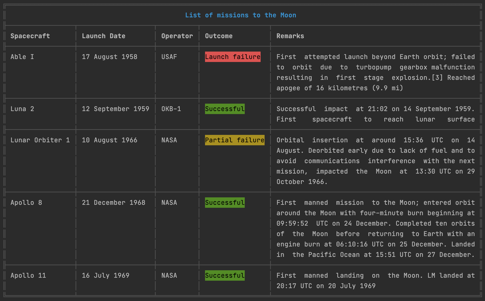

<h1 id="table">Table</h1>

[](https://travis-ci.org/gajus/table)
[](https://www.npmjs.com/package/table)
[](https://github.com/gajus/canonical)

* [Table](#table)
    * [Features](#table-features)
    * [Usage](#table-usage)
        * [Cell Content Alignment](#table-usage-cell-content-alignment)
        * [Column Width](#table-usage-column-width)
        * [Custom Border](#table-usage-custom-border)
        * [Padding Cell Content](#table-usage-padding-cell-content)
        * [Predefined Border Templates](#table-usage-predefined-border-templates)


Produces a string that represents array data in a text table.



<h2 id="table-features">Features</h2>

* Works with strings containing [fullwidth](https://en.wikipedia.org/wiki/Halfwidth_and_fullwidth_forms) characters.
* Works with strings containing [ANSI escape codes](https://en.wikipedia.org/wiki/ANSI_escape_code).
* Configurable border characters.
* Configurable content alignment per column.
* Configurable content padding per column.
* Configurable column width.
* Text wrapping.

<h2 id="table-usage">Usage</h2>

Table data is described using an array (rows) of array (cells).

```js
import table from 'table';

let data,
    output;

data = [
    ['0A', '0B', '0C'],
    ['1A', '1B', '1C'],
    ['2A', '2B', '2C']
];

/**
 * @typedef {string} table~cell
 */

/**
 * @typedef {table~cell[]} table~row
 */

/**
 * @typedef {Object} table~columns
 * @property {string} alignment Cell content alignment (enum: left, center, right) (default: left).
 * @property {number} width Column width (default: auto).
 * @property {number} paddingLeft Cell content padding width left (default: 1).
 * @property {number} paddingRight Cell content padding width right (default: 1).
 */

/**
 * @typedef {Object} table~border
 * @property {string} topBody
 * @property {string} topJoin
 * @property {string} topLeft
 * @property {string} topRight
 * @property {string} bottomBody
 * @property {string} bottomJoin
 * @property {string} bottomLeft
 * @property {string} bottomRight
 * @property {string} bodyLeft
 * @property {string} bodyRight
 * @property {string} bodyJoin
 * @property {string} joinBody
 * @property {string} joinLeft
 * @property {string} joinRight
 * @property {string} joinJoin
 */

/**
 * @typedef {Object} table~config
 * @property {table~border} border
 * @property {table~columns[]} columns Column specific configuration.
 */

/**
 * Generates a text table.
 *
 * @param {table~row[]} rows
 * @param {table~config} userConfig
 * @return {String}
 */
output = table(data);

console.log(output);
```

```
╔════╤════╤════╗
║ 0A │ 0B │ 0C ║
╟────┼────┼────╢
║ 1A │ 1B │ 1C ║
╟────┼────┼────╢
║ 2A │ 2B │ 2C ║
╚════╧════╧════╝
```


<h3 id="table-usage-cell-content-alignment">Cell Content Alignment</h3>

`config.columns[{number}].alignment` property controls content horizontal alignment within a cell.

Valid values are: "left", "right" and "center".

```js
let config,
    data,
    output;

data = [
    ['0A', '0B', '0C'],
    ['1A', '1B', '1C'],
    ['2A', '2B', '2C']
];

config = {
    column: {
        0: {
            alignment: 'left',
            minWidth: 10
        },
        1: {
            alignment: 'center',
            minWidth: 10
        },
        2: {
            alignment: 'right',
            minWidth: 10
        }
    }
};

output = table(data, config);

console.log(output);
```

```
╔════════════╤════════════╤════════════╗
║ 0A         │     0B     │         0C ║
╟────────────┼────────────┼────────────╢
║ 1A         │     1B     │         1C ║
╟────────────┼────────────┼────────────╢
║ 2A         │     2B     │         2C ║
╚════════════╧════════════╧════════════╝
```

<h3 id="table-usage-column-width">Column Width</h3>

`width` property restrictions column width to a fixed width.

```js
let data,
    output,
    options;

data = [
    ['0A', '0B', '0C'],
    ['1A', '1B', '1C'],
    ['2A', '2B', '2C']
];

options = {
    column: {
        1: {
            width: 10
        }
    }
};

output = table(data, options);

console.log(output);
```

```
╔════╤════════════╤════╗
║ 0A │ 0B         │ 0C ║
╟────┼────────────┼────╢
║ 1A │ 1B         │ 1C ║
╟────┼────────────┼────╢
║ 2A │ 2B         │ 2C ║
╚════╧════════════╧════╝
```

<h3 id="table-usage-custom-border">Custom Border</h3>

`config.columns[{number}].border` property describes characters used to draw the table border.

```js
let config,
    data,
    output;

data = [
    ['0A', '0B', '0C'],
    ['1A', '1B', '1C'],
    ['2A', '2B', '2C']
];

config = {
    border: {
        topBody: `─`,
        topJoin: `┬`,
        topLeft: `┌`,
        topRight: `┐`,

        bottomBody: `─`,
        bottomJoin: `┴`,
        bottomLeft: `└`,
        bottomRight: `┘`,

        bodyLeft: `│`,
        bodyRight: `│`,
        bodyJoin: `│`,

        joinBody: `─`,
        joinLeft: `├`,
        joinRight: `┤`,
        joinJoin: `┼`
    }
};

output = table(data, config);

console.log(output);
```

```
┌────┬────┬────┐
│ 0A │ 0B │ 0C │
├────┼────┼────┤
│ 1A │ 1B │ 1C │
├────┼────┼────┤
│ 2A │ 2B │ 2C │
└────┴────┴────┘
```

<h3 id="table-usage-padding-cell-content">Padding Cell Content</h3>

`config.columns[{number}].paddingLeft` and `config.columns[{number}].paddingRight` properties control content padding within a cell. Property value represents a number of whitespaces used to pad the content.

```js
let config,
    data,
    output;

data = [
    ['0A', 'AABBCC', '0C'],
    ['1A', '1B', '1C'],
    ['2A', '2B', '2C']
];

config = {
    column: {
        0: {
            paddingLeft: 3
        },
        1: {
            width: 2,
            paddingRight: 3
        }
    }
};

output = table(data, config);

console.log(output);
```

```
╔══════╤══════╤════╗
║   0A │ AA   │ 0C ║
║      │ BB   │    ║
║      │ CC   │    ║
╟──────┼──────┼────╢
║   1A │ 1B   │ 1C ║
╟──────┼──────┼────╢
║   2A │ 2B   │ 2C ║
╚══════╧══════╧════╝
```

<h3 id="table-usage-predefined-border-templates">Predefined Border Templates</h3>

You can load one of the predefined border templates using `getBorderCharacters` function.

```js
import table, {
    getBorderCharacters
} from 'table';

let config,
    data;

data = [
    ['0A', '0B', '0C'],
    ['1A', '1B', '1C'],
    ['2A', '2B', '2C']
];

config = {
    border: getBorderCharacters(`name of the template`)
};

table(data, config);
```

```
# honeywell

╔════╤════╤════╗
║ 0A │ 0B │ 0C ║
╟────┼────┼────╢
║ 1A │ 1B │ 1C ║
╟────┼────┼────╢
║ 2A │ 2B │ 2C ║
╚════╧════╧════╝

# norc

┌────┬────┬────┐
│ 0A │ 0B │ 0C │
├────┼────┼────┤
│ 1A │ 1B │ 1C │
├────┼────┼────┤
│ 2A │ 2B │ 2C │
└────┴────┴────┘

# ramac (ASCII; for use in terminals that do not support Unicode characters)

+----+----+----+
| 0A | 0B | 0C |
|----|----|----|
| 1A | 1B | 1C |
|----|----|----|
| 2A | 2B | 2C |
+----+----+----+
```

Raise [an issue](https://github.com/gajus/table/issues) if you'd like to contribute a new border template.

